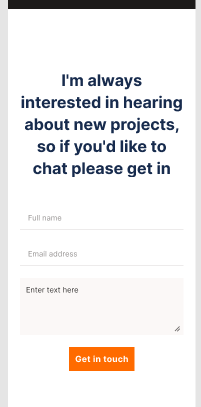

# contact-form
The goal is to create a contact form from figma. The original design is in the screenshot below  

## Built With

- HTML and CSS

## Live Demo

[Live Demo Link](#)

### Usage

Cd into the repository `cd contact`

Open the `index.html` file and run it with any browser of your choice

## Authors

👤 **Mimi Peshy**

- Github: [@githubhandle](https://github.com/mimipeshy)
- LinkedIn: [@linkedinhandle](https://www.linkedin.com/in/peris-ndanu-405083193/)
-Twitter :[@twitterhandle](https://twitter.com/pygirl254)

## 🤝 Contributing

Contributions, issues and feature requests are welcome!

Feel free to check the [issues page](issues/).

## Show your support

Give a ⭐️ if you like this project!

## Acknowledgments

- Hat tip to anyone whose code was used
- Inspiration
- etc

## 📝 License

This project is [MIT](./MIT.md) licensed.